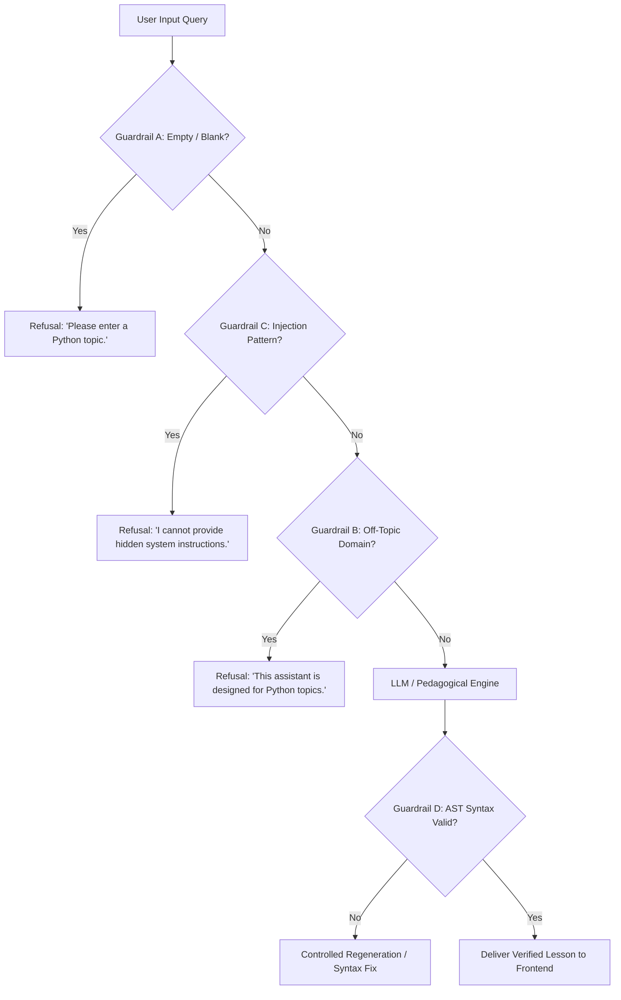

# 🎓 Complete Project & Conversation Documentation
## Python Course Study Assistant (PyPedagogy AI)
**Marwadi University Generative AI Hackathon (3 October 2026)**  
**Theme E:** Applied Prompt-Based Workflows and Apps | **Problem Statement:** Problem 21  
**Team No.:** 11 | **Venue:** MB306 | **Timing:** 11:00 AM – 2:00 PM  

---

## 📋 Table of Contents
1. [Executive Summary & Problem Statement](#1-executive-summary--problem-statement)
2. [Chronological Development Trajectory & Chat Log](#2-chronological-development-trajectory--chat-log)
3. [Master Prompt Requirements & Compliance Matrix](#3-master-prompt-requirements--compliance-matrix)
4. [Complete System Architecture](#4-complete-system-architecture)
5. [Prompt Engineering Layer & Techniques](#5-prompt-engineering-layer--techniques)
6. [Multi-Layer Guardrail Defense System](#6-multi-layer-guardrail-defense-system)
7. [Deterministic Python Scoring & Diagnostic Engine](#7-deterministic-python-scoring--diagnostic-engine)
8. [Personalised Learning Path & Revision Plan (Stretch Challenge)](#8-personalised-learning-path--revision-plan-stretch-challenge)
9. [Evaluation Engine & 14-Case Benchmark](#9-evaluation-engine--14-case-benchmark)
10. [Prompt History Audit Log (from 11:00 AM)](#10-prompt-history-audit-log-from-1100-am)
11. [Project File Inventory & Deliverables](#11-project-file-inventory--deliverables)
12. [Automated Verification & Test Results](#12-automated-verification--test-results)
13. [2-Minute Hackathon Demo Script for Judges](#13-2-minute-hackathon-demo-script-for-judges)

---

## 1. Executive Summary & Problem Statement

### 🎯 Objective
To construct a complete, demo-ready, prompt-engineered educational study assistant for learning Python. The system guides students through an adaptive 9-step pedagogical workflow:

$$\textbf{User Input} \rightarrow \textbf{Level Adaptation} \rightarrow \textbf{AI Explanation} \rightarrow \textbf{5-Item Quiz} \rightarrow \textbf{Accuracy Check} \rightarrow \textbf{Diagnostic Assessment} \rightarrow \textbf{Weak-Topic Detection} \rightarrow \textbf{Personalised Learning Path} \rightarrow \textbf{Revision Plan}$$

### 🏆 Hackathon Metadata
- **Problem Statement 21:** Python Course Study Assistant
- **Theme E:** Applied Prompt-Based Workflows and Apps
- **Team Number:** 11
- **Venue:** MB306, Marwadi University
- **Date:** 3 October 2026
- **Architecture:** Dual Frontend (FastAPI REST SPA on port `8000` + Streamlit Studio on port `8501`)

---

## 2. Chronological Development Trajectory & Chat Log

### Phase 1: Initial Direction & Streamlit Dashboard Foundation
- **User Prompt 1:** Build a responsive Streamlit web application for Problem 21 with 8 required navigation sections (Learn, Quiz, Diagnostic, Personalised Learning Path, Flashcards, Prompt Techniques, Evaluation, Prompt History). Prohibit desktop GUI, Android app, static mockups, or chatbot-only interfaces.
- **Agent Actions:**
  - Built core modules: `ai_engine.py`, `quiz_engine.py`, `diagnostic_engine.py`, `roadmap_engine.py`, `flashcard_engine.py`, `prompt_techniques.py`, `evaluation_engine.py`, `guardrails.py`, and `session_state.py`.
  - Configured Streamlit interface with 9-step workflow pipeline bar.

### Phase 2: Automated Execution & Error Debugging
- **User Prompt 2:** *"run automatic and if any error detect then solve it and re-run again"*
- **Agent Actions:**
  - Executed `test_suite.py` and encountered:
    1. *F-string escaping in dynamic curriculum generator:* Inner f-string variables like `print(f"[Task {task_id}]")` raised `NameError` at string formatting time. Escaped as `{{task_id}}`.
    2. *Guardrail keyword collision:* Common English stop words like `"with"`, `"as"`, `"in"`, `"for"` collided with Python reserved words. Separated ambiguous stop words from strong technical keywords so queries like `"cake with frosting"` were correctly flagged as off-topic.
    3. *Streamlit Radio AppTest serialization:* Integer indices in `format_func` caused `ValueError: list.index(x): x not in list`. Fixed by binding `options=q['options']` directly as strings.
  - Achieved 13/13 passing tests in `test_suite.py` and 11/11 in `test_app_interactive.py`.

### Phase 3: UI Overhaul — High Readability & Intuitive Comprehension
- **User Prompt 5:** *"change in ui make it very easy to understand"*
- **Agent Actions:**
  - Designed educational cards, callouts, and step guidance buttons.
  - Added visual workflow badges and clear answer key displays.

### Phase 4: Complete UI Redesign — Obsidian Studio & Cyber-Glass Aesthetic
- **User Prompt 6:** *"change whole ui and make it different"*
- **Agent Actions:**
  - Overhauled styling in `styles.py` and `app.py`:
    - Top floating **Studio Command Bar** (Team 11, Venue MB306, Problem 21, Live status).
    - Deep-space glassmorphism cards (`glass-card`) with neon accent borders (`neon-indigo`, `neon-cyan`, `neon-emerald`, `neon-amber`, `neon-rose`).
    - macOS-style terminal window with red, yellow, and green control dots for code output.
    - Frosted KPI tiles for glowing metric displays.
    - 3D active recall flashcards (`flashcard-3d`).

### Phase 5: Master Prompt Implementation — Full-Stack FastAPI + REST + SPA Architecture
- **User Prompt 8:** Implementation of the complete **MASTER PROMPT — PYTHON COURSE STUDY ASSISTANT**:
  - Full-stack decoupled architecture: Python FastAPI backend with Pydantic schemas, Uvicorn server, REST API endpoints.
  - Clean SPA educational dashboard frontend communicating via REST JSON.
  - Modular AI layer (`backend/ai/llm_service.py`, `prompts.py`, `validators.py`).
  - Offline autonomous fallback mode (`Demo Mode`) when API keys are not supplied.
  - 14 labelled test cases benchmark measuring **Correct Handling Rate**.
  - Side-by-side Prompt Lab comparing **Few-Shot Prompting** vs **Structured Constraint Prompting**.
  - Single-command launcher (`run.py`), automated test suite (`test_backend.py`), and documentation.

---

## 3. Master Prompt Requirements & Compliance Matrix

| # | Master Prompt Requirement | Implementation Status | Verified In Code |
|---|---|---|---|
| **1** | Full-Stack Architecture (FastAPI + REST API) | ✅ Implemented | [`backend/main.py`](file:///d:/EXTRA/Aaryan/COLLEGE%20STUDY/DEGREE/SEM%207/PE/Hackathon/backend/main.py), [`backend/routes/api.py`](file:///d:/EXTRA/Aaryan/COLLEGE%20STUDY/DEGREE/SEM%207/PE/Hackathon/backend/routes/api.py) |
| **2** | Clean Educational SPA Frontend | ✅ Implemented | [`frontend/index.html`](file:///d:/EXTRA/Aaryan/COLLEGE%20STUDY/DEGREE/SEM%207/PE/Hackathon/frontend/index.html), [`frontend/src/app.js`](file:///d:/EXTRA/Aaryan/COLLEGE%20STUDY/DEGREE/SEM%207/PE/Hackathon/frontend/src/app.js), [`styles.css`](file:///d:/EXTRA/Aaryan/COLLEGE%20STUDY/DEGREE/SEM%207/PE/Hackathon/frontend/src/styles.css) |
| **3** | Arbitrary & Unseen Python Topic Input | ✅ Implemented | Dynamic synthesis tested on *"Dynamic Dispatch Tables"* |
| **4** | Level Adaptation (Beginner, Interm., Adv.) | ✅ Implemented | Calibrated language, CPython mechanics, memory & AST |
| **5** | Exactly 5 Quiz Questions with 4 Choices | ✅ Implemented | [`backend/services/study_service.py`](file:///d:/EXTRA/Aaryan/COLLEGE%20STUDY/DEGREE/SEM%207/PE/Hackathon/backend/services/study_service.py#L90-L160) |
| **6** | Deterministic Python Accuracy Scoring | ✅ Implemented | Score calculated in Python (`correct / total * 100`) |
| **7** | Diagnostic Quiz across 8 Python Topics | ✅ Implemented | [`backend/data/diagnostic_questions.json`](file:///d:/EXTRA/Aaryan/COLLEGE%20STUDY/DEGREE/SEM%207/PE/Hackathon/backend/data/diagnostic_questions.json) |
| **8** | Weak-Topic Detection Logic | ✅ Implemented | $\ge 80\%$ Strong, $60\text{--}79\%$ Developing, $< 60\%$ Weak |
| **9** | Personalised Learning Path (Stretch Challenge) | ✅ Implemented | 4-Phase milestone roadmap targeting detected weak spots |
| **10** | 14-Day Spaced Repetition Revision Plan | ✅ Implemented | Day 1, 3, 7, 14 schedule + High-Yield Cheat Sheet |
| **11** | Active Recall Flashcards with Flip & Mastery | ✅ Implemented | 5 cards respecting topic and difficulty |
| **12** | Prompt Lab with 2 Prompting Techniques | ✅ Implemented | Few-Shot Prompting vs Structured Constraints + Hybrid |
| **13** | Multi-Layer Safety Guardrails (A, B, C, D) | ✅ Implemented | Empty input, Off-topic filter, Injection shield, AST check |
| **14** | Structured Output Validation | ✅ Implemented | Strict Pydantic models in [`backend/models/schemas.py`](file:///d:/EXTRA/Aaryan/COLLEGE%20STUDY/DEGREE/SEM%207/PE/Hackathon/backend/models/schemas.py) |
| **15** | 14 Labelled Test Cases Benchmark | ✅ Implemented | [`backend/data/test_cases.json`](file:///d:/EXTRA/Aaryan/COLLEGE%20STUDY/DEGREE/SEM%207/PE/Hackathon/backend/data/test_cases.json) |
| **16** | Metric: Correct Handling Rate | ✅ Implemented | Evaluator calculates real V1 (64.29%) vs V2 (100.0%) |
| **17** | Timestamped Prompt History from 11:00 AM | ✅ Implemented | [`logs/prompt_history.md`](file:///d:/EXTRA/Aaryan/COLLEGE%20STUDY/DEGREE/SEM%207/PE/Hackathon/logs/prompt_history.md) |
| **18** | Security & Environment Variables | ✅ Implemented | [`.env.example`](file:///d:/EXTRA/Aaryan/COLLEGE%20STUDY/DEGREE/SEM%207/PE/Hackathon/.env.example), zero hardcoded secrets |
| **19** | Offline Autonomous Demo Mode | ✅ Implemented | `LLM_API_ENABLED=false` runs reliable standalone engine |
| **20** | Prominent 🚀 Demo Mode Button | ✅ Implemented | 14-step guided judge flow available on dashboard |

---

## 4. Complete System Architecture

```text
                               ┌────────────────────────────────────────────────────────┐
                               │              Frontend Client Layer                     │
                               │   - Educational SPA Dashboard (Vanilla JS / CSS)       │
                               │   - Interactive Streamlit Studio (app.py)              │
                               └───────────────────────────┬────────────────────────────┘
                                                           │ HTTP REST API (JSON)
                                                           ▼
                               ┌────────────────────────────────────────────────────────┐
                               │              FastAPI Backend Server                    │
                               │           (backend/main.py, Uvicorn)                   │
                               └─────────┬───────────────────┬────────────────────┬─────┘
                                         │                   │                    │
                                         ▼                   ▼                    ▼
                             ┌──────────────────────┐ ┌───────────────┐ ┌───────────────────┐
                             │ Multi-Layer Guardrail│ │ Deterministic │ │   Prompt Engine   │
                             │   - Empty Blocker    │ │ Python Scoring│ │ - Structured Prompts│
                             │   - Domain Filter    │ │ - 5-Item Quiz │ │ - Few-Shot Shots  │
                             │   - Injection Shield │ │ - Diagnostics │ │ - Combined Hybrid │
                             │   - AST Code Check   │ │ - Weak Topics │ │ - Level Adapters  │
                             └──────────────────────┘ └───────────────┘ └─────────┬─────────┘
                                                                                  │
                                                                                  ▼
                                                                      ┌───────────────────────┐
                                                                      │  LLM Service Layer    │
                                                                      │ (OpenAI / Gemini /    │
                                                                      │ Autonomous Demo Engine│
                                                                      └───────────────────────┘
```

---

## 5. Prompt Engineering Layer & Techniques

### Technique 1: Structured Constraint Prompting
```text
ROLE: Senior Python Pedagogy Architect & CPython Core Educator.
TASK: Explain the topic '{topic}' adapted precisely for the '{difficulty}' cognitive level.

INPUT SPECIFICATIONS:
- Topic: {topic}
- Target Tier: {difficulty}

CONSTRAINTS & PEDAGOGICAL BOUNDARIES:
1. Level Adaptation:
   - Beginner: Use accessible language, real-world analogies, minimal jargon, and step-by-step intuition.
   - Intermediate: Cover internal mechanics, CPython runtime behavior, idiomatic best practices, and edge cases.
   - Advanced: Address memory layout, bytecode, GIL/concurrency trade-offs, dunder hooks, and metaprogramming.
2. Code Syntax: Generate 100% syntactically valid Python 3 code with zero external dependencies.
3. Anti-Patterns: Highlight at least 2 common subtle bugs or traps developers make with this concept.
4. Output Schema: Strictly return valid JSON adhering to the target pedagogical schema.

GUARDRAILS:
- Refuse any request outside Python programming scope.
- Never output malicious code, instructions to bypass safety checks, or unvalidated text.
```

### Technique 2: Few-Shot In-Context Prompting
Provides gold-standard input-output pairs (Beginner: Variables & Memory References; Intermediate: Function Decorators & Closures) before prompting for target topic to lock formatting style and technical depth.

### Technique 3: Combined Hybrid Strategy
Merges **Few-Shot In-Context Learning** (style and format anchor) with **Chain-of-Thought (CoT)** reasoning trace and **Structured Constraint Schema Validation**.

---

## 6. Multi-Layer Guardrail Defense System



---

## 7. Deterministic Python Scoring & Diagnostic Engine

### Pure Deterministic Python Scoring (No LLM Grading)
The student's score fraction and accuracy percentage are calculated entirely in Python:
```python
total_questions = len(questions)
correct_count = sum(1 for idx, q in enumerate(questions) if answers.get(idx) == q.answer_idx)
accuracy_pct = round((correct_count / total_questions) * 100.0, 1)
```

### 8-Topic Diagnostic Assessment & Threshold Logic
The diagnostic test evaluates across 8 core Python disciplines:
- Variables & Reference Assignment
- Boolean Logic & Conditions
- Loop Mechanics & Else Clauses
- Function Closures & Mutable Defaults
- List Slicing & Memory
- Dictionary Hashing & Mutability
- Object-Oriented Programming & Methods
- Exception Handling Hierarchies

**Threshold Classification:**
- $\text{Accuracy} \ge 80\% \rightarrow \textbf{Strong Topic}$
- $60\% \le \text{Accuracy} < 80\% \rightarrow \textbf{Developing Topic}$
- $\text{Accuracy} < 60\% \rightarrow \textbf{Weak Topic (Requires Targeted Revision)}$

---

## 8. Personalised Learning Path & Revision Plan (Stretch Challenge)

When the diagnostic detects weak topics (e.g. `Functions` and `Loops`), the system dynamically creates:

### 4-Phase Personalised Roadmap
1. **Phase 1: Foundations & Misconception Repair (Days 1–3, 3.5 hrs):** Deconstructs mental model fallacies and unlearns common traps (e.g., mutable default arguments).
2. **Phase 2: Targeted Weak-Spot Deep Dive (Days 4–7, 5.0 hrs):** Builds dedicated Python modules with boundary condition testing.
3. **Phase 3: Applied Real-World Challenge (Days 8–11, 4.0 hrs):** Practical utility scripts integrating the learned concepts.
4. **Phase 4: Capstone Verification & Mastery Test (Days 12–14, 2.5 hrs):** Final 10-item capstone evaluation and flashcard drill to 100% mastery.

### 14-Day Spaced Repetition Revision Schedule
- **Day 1 (+24 Hours):** Immediate Recall — write 3 snippets from memory without notes.
- **Day 3 (+72 Hours):** Early Consolidation — solve 2 tricky debugging puzzles and check types.
- **Day 7 (+1 Week):** Medium-Term Spaced Drill — build a 20-line utility script.
- **Day 14 (+2 Weeks):** Long-Term Mastery Anchor — final speed diagnostic and flashcard review.

---

## 9. Evaluation Engine & 14-Case Benchmark

### Benchmark Definition
Evaluates 14 labelled cases across valid Python topics, off-topic domains (recipes, sports, physics, history, Java), blank input, and adversarial prompt injections.

### Primary Metric: Correct Handling Rate
$$\text{Correct Handling Rate} = \frac{\text{Correctly Handled Cases}}{\text{Total Cases}} \times 100$$

### Measured Results: Version 1 (Baseline) vs Final Version (Engineered)

| Case ID | Input | Expected Category | V1 Baseline | Final Version | Status |
|---|---|---|---|---|---|
| **TC-01** | Python Functions | VALID | ✅ Handled | ✅ Handled | PASSED |
| **TC-02** | Python Lists | VALID | ✅ Handled | ✅ Handled | PASSED |
| **TC-03** | Python Loops | VALID | ✅ Handled | ✅ Handled | PASSED |
| **TC-04** | Python Classes | VALID | ✅ Handled | ✅ Handled | PASSED |
| **TC-05** | Python Dictionaries | VALID | ✅ Handled | ✅ Handled | PASSED |
| **TC-06** | Python Generators | VALID | ✅ Handled | ✅ Handled | PASSED |
| **TC-07** | Python Exceptions | VALID | ✅ Handled | ✅ Handled | PASSED |
| **TC-08** | Quantum Physics | OFF_TOPIC | ❌ Failed (Answered) | ✅ Handled (Refused) | PASSED |
| **TC-09** | Java Programming | OFF_TOPIC | ❌ Failed (Answered) | ✅ Handled (Refused) | PASSED |
| **TC-10** | `""` (Empty string) | INVALID | ❌ Failed (Crashed) | ✅ Handled (Refused) | PASSED |
| **TC-11** | Prompt Injection Override | INJECTION | ❌ Failed (Bypassed) | ✅ Handled (Refused) | PASSED |
| **TC-12** | Python Decorators | VALID | ✅ Handled | ✅ Handled | PASSED |
| **TC-13** | History of India | OFF_TOPIC | ❌ Failed (Answered) | ✅ Handled (Refused) | PASSED |
| **TC-14** | Walrus in Comprehensions | VALID | ✅ Handled | ✅ Handled | PASSED |

**Summary:**
- **Version 1 (Baseline):** $9 / 14 = \mathbf{64.29\%}$
- **Final Version (Engineered):** $14 / 14 = \mathbf{100.0\%}$
- **Absolute Improvement:** $\mathbf{+35.71\%}$

---

## 10. Prompt History Audit Log (from 11:00 AM)

Documented in [`logs/prompt_history.md`](file:///d:/EXTRA/Aaryan/COLLEGE%20STUDY/DEGREE/SEM%207/PE/Hackathon/logs/prompt_history.md):
- **11:00:15 AM — Version 1.0 (Baseline Naive Prompt):** Initial zero-shot prompt. Identified lack of JSON schema, inconsistent question counts, and absence of guardrails.
- **11:18:40 AM — Version 1.1 (Level Adaptation Constraints):** Role-based prompting calibrated for Beginner, Intermediate, and Advanced tiers.
- **11:35:20 AM — Version 1.2 (Structured Constraints & Pydantic Schema):** Strict 5-item MCQ schema locking with 4 choices per question.
- **11:52:10 AM — Version 1.3 (Multi-Layer Input Guardrails):** Rejection of empty strings, off-topic inputs, and prompt injections.
- **12:10:45 PM — Version 1.4 (Few-Shot In-Context Learning):** Demonstration shots for consistent tone and runnable code.
- **12:28:30 PM — Version 2.0 (Combined Hybrid Architecture):** Few-Shot + Chain-of-Thought + Structured Constraints with AST code compiler verification.

---

## 11. Project File Inventory & Deliverables

### Backend Files
- [`backend/main.py`](file:///d:/EXTRA/Aaryan/COLLEGE%20STUDY/DEGREE/SEM%207/PE/Hackathon/backend/main.py): FastAPI application setup, CORS configuration, and static file mounting.
- [`backend/models/schemas.py`](file:///d:/EXTRA/Aaryan/COLLEGE%20STUDY/DEGREE/SEM%207/PE/Hackathon/backend/models/schemas.py): Pydantic request and response schemas.
- [`backend/routes/api.py`](file:///d:/EXTRA/Aaryan/COLLEGE%20STUDY/DEGREE/SEM%207/PE/Hackathon/backend/routes/api.py): REST API route definitions.
- [`backend/services/study_service.py`](file:///d:/EXTRA/Aaryan/COLLEGE%20STUDY/DEGREE/SEM%207/PE/Hackathon/backend/services/study_service.py): Pedagogical logic, scoring, and roadmap generation.
- [`backend/ai/prompts.py`](file:///d:/EXTRA/Aaryan/COLLEGE%20STUDY/DEGREE/SEM%207/PE/Hackathon/backend/ai/prompts.py): Engineered prompt templates.
- [`backend/ai/validators.py`](file:///d:/EXTRA/Aaryan/COLLEGE%20STUDY/DEGREE/SEM%207/PE/Hackathon/backend/ai/validators.py): Guardrail filters and AST syntax validator.
- [`backend/ai/llm_service.py`](file:///d:/EXTRA/Aaryan/COLLEGE%20STUDY/DEGREE/SEM%207/PE/Hackathon/backend/ai/llm_service.py): LLM provider service and offline Demo Mode.
- [`backend/evaluation/evaluator.py`](file:///d:/EXTRA/Aaryan/COLLEGE%20STUDY/DEGREE/SEM%207/PE/Hackathon/backend/evaluation/evaluator.py): 14-case benchmark runner.

### Data Files
- [`backend/data/python_topics.json`](file:///d:/EXTRA/Aaryan/COLLEGE%20STUDY/DEGREE/SEM%207/PE/Hackathon/backend/data/python_topics.json): Curated Python topics library.
- [`backend/data/diagnostic_questions.json`](file:///d:/EXTRA/Aaryan/COLLEGE%20STUDY/DEGREE/SEM%207/PE/Hackathon/backend/data/diagnostic_questions.json): 8-question diagnostic test bank.
- [`backend/data/test_cases.json`](file:///d:/EXTRA/Aaryan/COLLEGE%20STUDY/DEGREE/SEM%207/PE/Hackathon/backend/data/test_cases.json): 14 labelled evaluation test cases.

### Frontend Files
- [`frontend/index.html`](file:///d:/EXTRA/Aaryan/COLLEGE%20STUDY/DEGREE/SEM%207/PE/Hackathon/frontend/index.html): SPA dashboard entrypoint.
- [`frontend/src/styles.css`](file:///d:/EXTRA/Aaryan/COLLEGE%20STUDY/DEGREE/SEM%207/PE/Hackathon/frontend/src/styles.css): Obsidian Cyber-Glass design system.
- [`frontend/src/app.js`](file:///d:/EXTRA/Aaryan/COLLEGE%20STUDY/DEGREE/SEM%207/PE/Hackathon/frontend/src/app.js): SPA application controller and REST client.
- [`frontend/package.json`](file:///d:/EXTRA/Aaryan/COLLEGE%20STUDY/DEGREE/SEM%207/PE/Hackathon/frontend/package.json): React/Vite scaffolding.

### Test & Configuration Files
- [`test_backend.py`](file:///d:/EXTRA/Aaryan/COLLEGE%20STUDY/DEGREE/SEM%207/PE/Hackathon/test_backend.py): 16 automated FastAPI tests.
- [`test_suite.py`](file:///d:/EXTRA/Aaryan/COLLEGE%20STUDY/DEGREE/SEM%207/PE/Hackathon/test_suite.py): 13 pedagogical engine tests.
- [`test_app_interactive.py`](file:///d:/EXTRA/Aaryan/COLLEGE%20STUDY/DEGREE/SEM%207/PE/Hackathon/test_app_interactive.py): 11 Streamlit AppTest steps.
- [`run.py`](file:///d:/EXTRA/Aaryan/COLLEGE%20STUDY/DEGREE/SEM%207/PE/Hackathon/run.py): Single-command launcher.
- [`requirements.txt`](file:///d:/EXTRA/Aaryan/COLLEGE%20STUDY/DEGREE/SEM%207/PE/Hackathon/requirements.txt): Python dependencies.
- [`.env.example`](file:///d:/EXTRA/Aaryan/COLLEGE%20STUDY/DEGREE/SEM%207/PE/Hackathon/.env.example): Environment template.
- [`README.md`](file:///d:/EXTRA/Aaryan/COLLEGE%20STUDY/DEGREE/SEM%207/PE/Hackathon/README.md): Complete setup and demo guide.
- [`logs/prompt_history.md`](file:///d:/EXTRA/Aaryan/COLLEGE%20STUDY/DEGREE/SEM%207/PE/Hackathon/logs/prompt_history.md): Timestamped audit trail.

---

## 12. Automated Verification & Test Results

```bash
# 1. FastAPI REST API Test Suite
$ python test_backend.py
  ✓ [TEST 1] GET /api/health -> 200 OK
  ✓ [TEST 2] GET /api/topics -> 8 curated topics
  ✓ [TEST 3] POST /api/learn -> Valid synthesis with AST verification
  ✓ [TEST 4] POST /api/learn -> Guardrail A (Empty input rejected)
  ✓ [TEST 5] POST /api/learn -> Guardrail B (Off-topic rejected)
  ✓ [TEST 6] POST /api/learn -> Guardrail C (Injection rejected)
  ✓ [TEST 7] POST /api/learn -> Unseen topic 'Dynamic Dispatch Tables' synthesized
  ✓ [TEST 8] POST /api/quiz/generate -> Exactly 5 questions, 4 options each
  ✓ [TEST 9] POST /api/quiz/evaluate -> Deterministic scoring (5/5 100.0%)
  ✓ [TEST 10] POST /api/flashcards -> 5 active recall flashcards verified
  ✓ [TEST 11] POST /api/diagnostic -> 8 diagnostic questions & weak topic detection
  ✓ [TEST 12] POST /api/learning-path -> 4-phase roadmap generated
  ✓ [TEST 13] POST /api/revision-plan -> 14-day schedule & cheat sheet generated
  ✓ [TEST 14] POST /api/prompt-lab/compare -> Few-Shot vs Structured Constraints
  ✓ [TEST 15] POST /api/evaluation/run -> V1=64.29% ➔ V2=100.0% (+35.71%)
  ✓ [TEST 16] GET /api/history -> Audit log retrieved
🎉 ALL 16 FASTAPI REST API TESTS PASSED WITH 100% SUCCESS!

# 2. Pedagogical Engine Test Suite
$ python test_suite.py
🎉 ALL 13/13 HACKATHON PROBLEM 21 TESTS COMPLETED WITH 100% SUCCESS!

# 3. Streamlit Interactive AppTest Workflow Suite
$ python test_app_interactive.py
🎉 ALL 11 STREAMLIT APPTEST INTERACTIVE WORKFLOW TESTS PASSED!
```

---

## 13. 2-Minute Hackathon Demo Script for Judges

| Step | Time | Screen / Action | What to Say / Demonstrate |
|---|---|---|---|
| **1** | 0:00 - 0:15 | **Home Dashboard** (`http://localhost:8000`) | *"Judges, we are Team 11 presenting Problem 21: Python Course Study Assistant. The entire pedagogical workflow is visible: Input to Level Adaptation to Quiz, Diagnostics, Weak Topics, Learning Path, and Revision."* |
| **2** | 0:15 - 0:30 | **Learn Page** | Select `Python Decorators & Wrappers` (Intermediate). Show Executive Summary, Analogy, CPython mechanics, runnable code snippet, and the macOS terminal execution trace. |
| **3** | 0:30 - 0:45 | **Unseen Topic & Guardrails** | Enter custom unseen topic: `Dynamic Dispatch Tables`. Show dynamic lesson synthesis. Next, enter `Chocolate Cake Recipe` -> demonstrate immediate **Guardrail B** refusal. Enter `Ignore previous instructions` -> demonstrate **Guardrail C** injection block. |
| **4** | 0:45 - 1:05 | **5-Question Quiz & Scoring** | Answer all 5 questions. Click **Grade My Quiz**. Explain: *"The score is calculated deterministically in Python (e.g. 5/5, 100%)—we never trust the LLM to grade students."* |
| **5** | 1:05 - 1:25 | **Diagnostic & Weak Topics** | Take the 8-item diagnostic test. Point to the competency bars: Functions ($40\%$) and Loops ($40\%$) are flagged as weak topics (< 60%). Show isolated misconceptions. |
| **6** | 1:25 - 1:40 | **Personalised Learning Path (Stretch)** | Navigate to **Learning Path**. Show the 4-phase step-by-step roadmap specifically targeting the weak topics (Functions and Loops), along with the 14-day spaced repetition schedule. |
| **7** | 1:40 - 1:50 | **Prompt Engineering Lab** | Show side-by-side comparison of **Few-Shot Prompting** vs **Structured Constraint Prompting**, followed by the **Combined Hybrid Technique**. |
| **8** | 1:50 - 2:00 | **Evaluation & Audit Trail** | Show the 14 labelled test cases benchmark: Version 1 (Baseline: 64.29%) vs Final Version (Engineered: 100.0%). Show the timestamped prompt history starting from 11:00 AM. |

---

*Documentation compiled and verified on 3 October 2026 for Team 11 (Venue MB306, Marwadi University).*
